

  

# 📊 Recruitment Management Dashboard

A powerful admin and company dashboard designed to manage the entire recruitment process, with advanced analytics and AI-driven insights.

---

##  Features

- Admin dashboard with KPIs (total companies, jobs, users, most in-demand jobs, conversion rate)  
- Company dashboard with personalized analytics for their own job listings  
- Full CRUD operations for companies, jobs, applications, categories, and users  
- Advanced search and filtering across all modules  
- Application management with status control and workflow tracking  
- AI-powered candidate scoring and evaluation display  
- In-platform CV preview for applications  
- Role-based access control (Admin & Company)  
- Soft delete system with archive, restore, and permanent delete options  

---

##  Tech Stack

- Laravel  
- PHP  
- Blade  
- Alpine.js  
- MariaDB  
- Tailwind CSS  
- Docker  
- HTML5  

---

##  Installation

1. Clone the repository:  
   git clone https://github.com/ahmedibra24/job_backoffice_sha8lni.git  

2. Navigate to project folder:  
   cd recruitment-dashboard  

3. Install dependencies:  
   composer install  
   npm install  

4. Setup environment file:  
   cp .env.example .env  

5. Configure database in `.env` file  

6. Run migrations:  
   php artisan migrate  

7. Generate application key:  
   php artisan key:generate  

8. Run development server:  
   php artisan serve  

9. Compile assets:  
   npm run dev  

10. Open in browser:  
    http://localhost:8000  

---

##  Usage

- Admin can manage companies, users, jobs, and applications  
- Companies can manage their own job listings and applications  
- Track applications with status updates and workflow  
- View AI-based candidate scoring and evaluation  
- Access dashboards with real-time analytics  

---

##  Screenshots

- Login
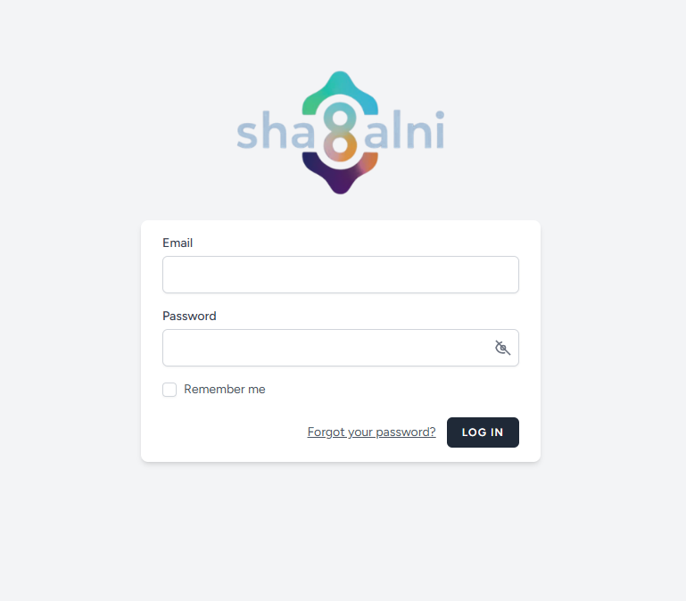  

- Dashboard
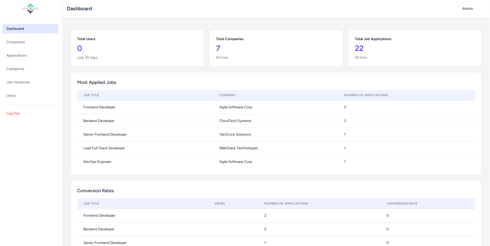  

- Companies
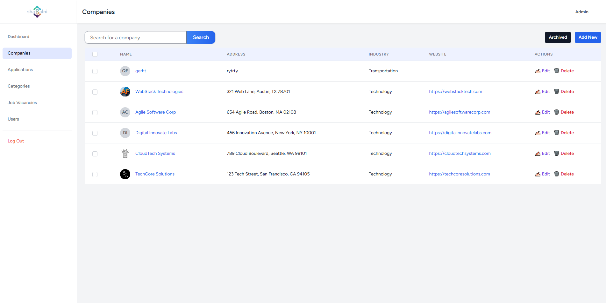  

- Archive Companies
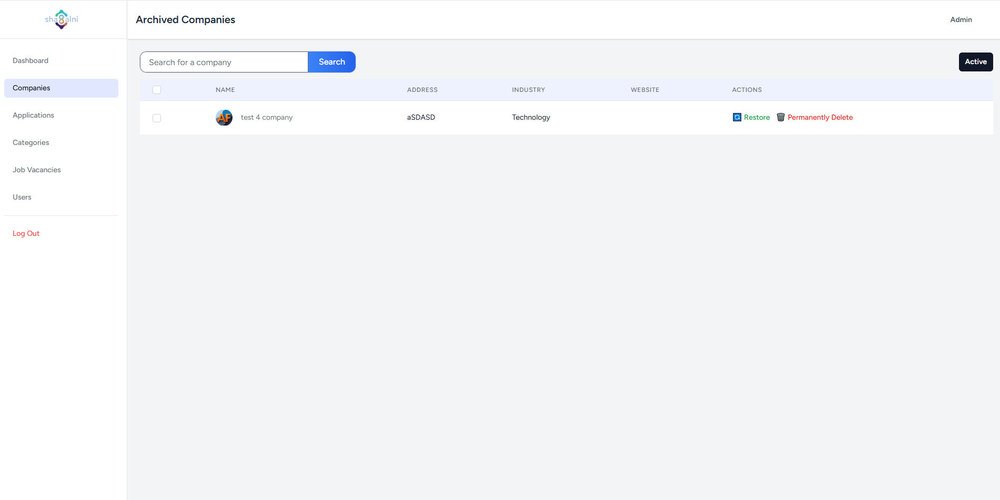  

- Company Details
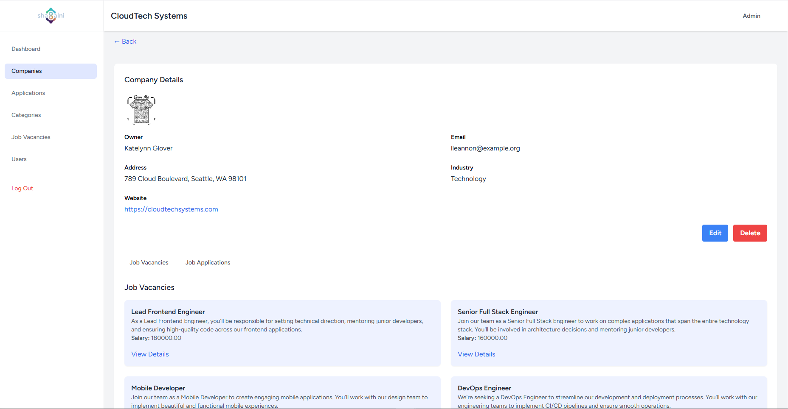  

- Edit Company
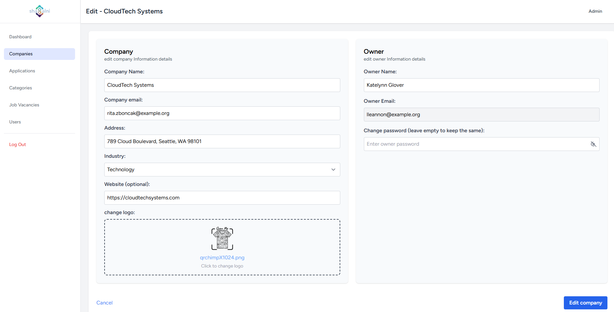  

- Applications
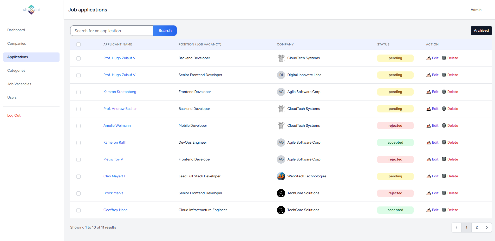  

- Applications Details
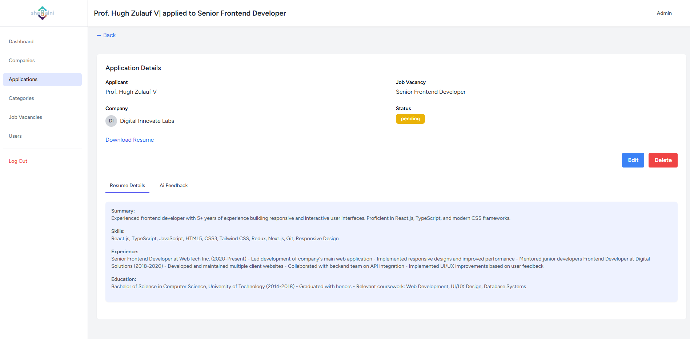  

- Job Vacancies
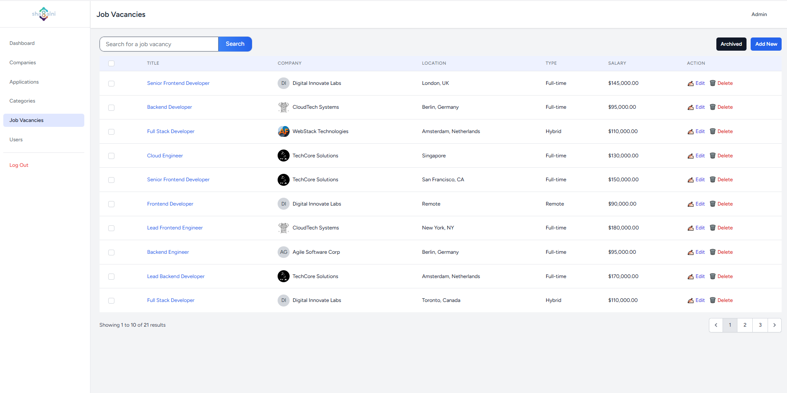  

- Create Job Vacancy
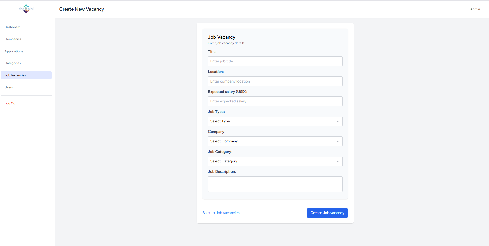  

- Categories
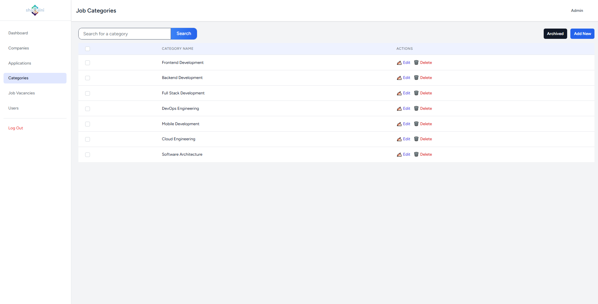  

- Users
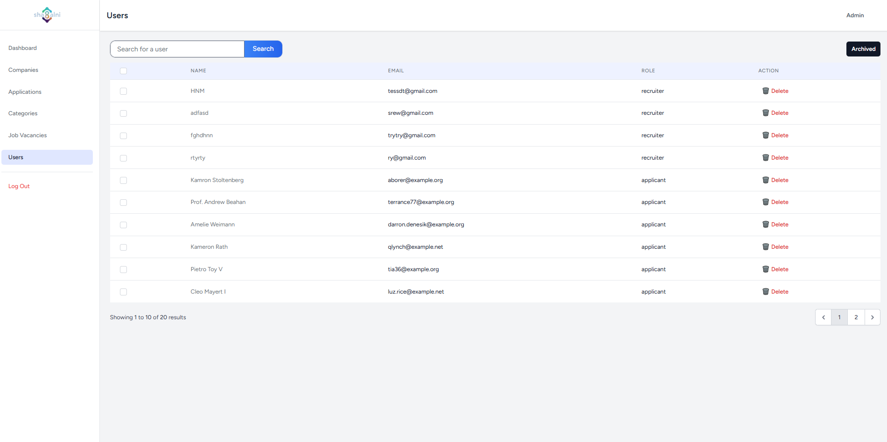  

- Company Owner
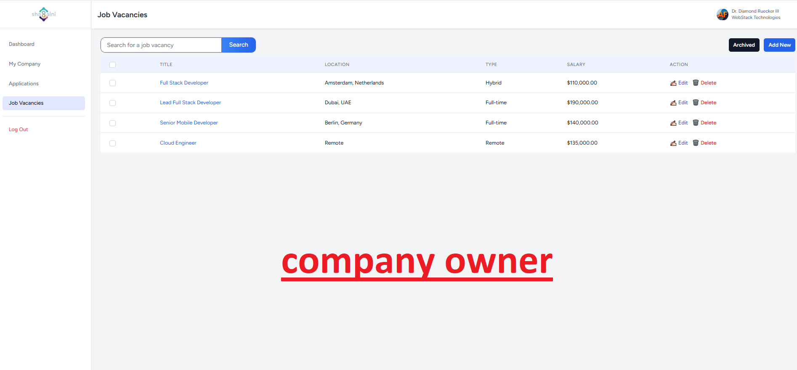  

---

##  Challenges Solved

- Designing role-based dashboards with different access levels  
- Managing complex relationships between companies, jobs, and applications  
- Integrating AI-based evaluation into the workflow  
- Handling large datasets with efficient filtering and search  
- Building a reliable soft delete and recovery system  

---

##  Future Improvements

- Real-time notifications system  
- Advanced analytics and reporting  
- Email integration for application updates  
- Multi-language support  
- API integration for external services  

---